# 📦 Import Export App

Aplikasi **Import & Export Data** berbasis Flask untuk mengelola proses import file data (CSV/TXT/ZIP) ke database MySQL, dengan fitur validasi, tracking job, dan upload otomatis ke Google Drive.

## ⚙️ Tech Stack

| Komponen | Teknologi |
|----------|-----------|
| Backend | Python 3 + Flask |
| Database | MySQL |
| Data Processing | Pandas |
| File Storage | Google Drive API |
| Session | Flask-Session |
| CORS | Flask-CORS |

## 🚀 Instalasi

```bash
# Clone repository
git clone <repo-url>
cd import_export_app

# Buat virtual environment
python3 -m venv venv
source venv/bin/activate

# Install dependencies
pip install -r requirements.txt

# Setup environment variables
cp .env.example .env
# Edit .env dengan konfigurasi database & Google Drive

# Setup database
python3 db_setup.py

# Jalankan aplikasi
python3 app.py
```

### Environment Variables

```env
DB_HOST=localhost
DB_USER=root
DB_PASSWORD=your_password
DB_NAME=your_database
GDRIVE_CREDENTIALS=path/to/service-account.json
GDRIVE_FOLDER_ID=your_gdrive_folder_id
```

---

## 📋 API Endpoints

### Import & Jobs

| Method | Endpoint | Deskripsi |
|--------|----------|-----------|
| `POST` | `/api/import` | Upload & import files |
| `GET` | `/api/jobs` | List semua import jobs |
| `GET` | `/api/jobs/<batch_id>` | Status job tertentu |
| `GET` | `/api/jobs/<batch_id>/details` | Detail per-file dalam batch |

### Table & Column Config

| Method | Endpoint | Deskripsi |
|--------|----------|-----------|
| `GET` | `/api/tables` | List import tables |
| `POST` | `/api/tables` | Buat table baru |
| `GET` | `/api/tables/<name>/columns` | Config kolom suatu table |
| `POST` | `/api/tables/<name>/columns` | Tambah kolom |
| `PUT` | `/api/tables/<id>/filename` | Update allowed filename |
| `PUT` | `/api/columns/<id>` | Update config kolom |
| `POST` | `/api/columns/<id>/aliases` | Tambah alias kolom |
| `DELETE` | `/api/aliases/<id>` | Hapus alias |

---

## 🔄 Flowchart Validasi API Import (`POST /api/import`)

### Parameter Request

| Parameter | Type | Deskripsi |
|-----------|------|-----------|
| `files` | File[] | File yang akan diimport (CSV/TXT/ZIP) |
| `mode` | string | `quick` / `full` / kosong = `both` |
| `table_name` | string | Nama table target, default `auto` |
| `dist_id` | string | Distributor ID untuk validasi prefix |

---

### Diagram 1: Alur Utama API Import

```mermaid
flowchart TD
    A["POST /api/import (files, mode, table_name, dist_id)"] --> B{"Ada files yang dikirim?"}
    B -- Tidak --> B1["❌ Return: No files provided"]
    B -- Ya --> C["Tentukan Mode (quick / full / both)"]

    C --> D["📂 Step 1: Save & Extract Files"]
    D --> D1{"Untuk setiap file"}
    D1 --> D2{"Ekstensi file?"}
    D2 -- ".zip" --> D3["Extract ZIP"]
    D3 --> D4{"ZIP valid?"}
    D4 -- Ya --> D5["Tambah extracted files ke all_file_paths"]
    D4 -- Tidak --> D6["⚠️ Warning: Invalid ZIP"]
    D2 -- ".csv / .txt" --> D7["Tambah ke all_file_paths"]
    D2 -- Lainnya --> D8["⚠️ Warning: Unsupported, skip"]

    D5 --> D9{"Masih ada file lain?"}
    D6 --> D9
    D7 --> D9
    D8 --> D9
    D9 -- Ya --> D1
    D9 -- Tidak --> E{"all_file_paths kosong?"}
    E -- Ya --> E1["❌ Return: No valid data files"]
    E -- Tidak --> F["Generate batch_id"]

    F --> G{"Mode?"}

    G -- quick --> Q["🔍 Mode Quick"]
    G -- full --> FL["📦 Mode Full"]
    G -- both --> BT["🔄 Mode Both"]

    Q --> QV["Quick Validate setiap file"]
    QV --> QR{"Semua gagal?"}
    QR -- Ya --> QF["❌ All files failed"]
    QR -- Tidak --> QS["✅ Return: Validation completed"]

    FL --> FJ["Create import_job per file"]
    FJ --> FV["Quick Validate setiap file"]
    FV --> FR{"Semua gagal?"}
    FR -- Ya --> FF["❌ All files failed"]
    FR -- Tidak --> FT["🚀 Start Async Thread"]
    FT --> FM["Check Missing Table Files"]
    FM --> FS["✅ Return 202: Import started"]

    BT --> BJ["Create import_job per file"]
    BJ --> BV["Quick Validate setiap file"]
    BV --> BR{"Semua gagal?"}
    BR -- Ya --> BF["❌ All files failed"]
    BR -- Tidak --> BTT["🚀 Start Async Thread"]
    BTT --> BTM["Check Missing Table Files"]
    BTM --> BS["✅ Return: Validation + Import started"]

    style A fill:#4A90D9,color:#fff
    style B1 fill:#E74C3C,color:#fff
    style E1 fill:#E74C3C,color:#fff
    style QF fill:#E74C3C,color:#fff
    style FF fill:#E74C3C,color:#fff
    style BF fill:#E74C3C,color:#fff
    style QS fill:#27AE60,color:#fff
    style FS fill:#27AE60,color:#fff
    style BS fill:#27AE60,color:#fff
```



---

### Diagram 2: Detail Quick Validate File

Fungsi `quick_validate_file()` melakukan **7 tahap validasi** secara bertahap:

```mermaid
flowchart TD
    V1["quick_validate_file (filepath, table_name, dist_id)"] --> V2["1️⃣ Cek file exists & extension (.csv/.txt)"]
    V2 --> V2R{"Valid?"}
    V2R -- Tidak --> V2F["❌ File not found / Unsupported extension"]
    V2R -- Ya --> V3["2️⃣ Baca file CSV (pd.read_csv)"]
    V3 --> V3R{"File kosong?"}
    V3R -- Ya --> V3F["❌ File is empty"]
    V3R -- Tidak --> V4["3️⃣ Normalize headers (lowercase, strip)"]

    V4 --> V5{"table_name = auto?"}
    V5 -- Ya --> V6["4️⃣ Auto-detect: cocokkan filename dengan allowed_filename"]
    V6 --> V6R{"Dikenali?"}
    V6R -- Tidak --> V6F["❌ Filename not recognized"]
    V6R -- Ya --> V7["Set table_name"]
    V5 -- Tidak --> V7

    V7 --> V8["5️⃣ Load column configs"]
    V8 --> V8R{"Config ada?"}
    V8R -- Tidak --> V8F["❌ No column config found"]
    V8R -- Ya --> V9["6️⃣ Cek Mandatory Columns"]

    V9 --> V9D["Cek setiap mandatory column ada di headers (+ alias)"]
    V9D --> V9R{"Ada yang hilang?"}
    V9R -- Ya --> V9F["❌ Missing mandatory columns"]
    V9R -- Tidak --> V10{"dist_id diberikan?"}

    V10 -- Ya --> V11["7️⃣a Cek DistID Prefix"]
    V11 --> V11D["5 baris pertama: bandingkan 2 digit awal"]
    V11D --> V11R{"Prefix cocok?"}
    V11R -- Tidak --> V11F["❌ DistID prefix mismatch"]
    V11R -- Ya --> V12["7️⃣b Validate Sample Rows"]
    V10 -- Tidak --> V12

    V12 --> V12D["Cek 2 baris pertama: • mandatory not empty • int parseable • date format valid"]
    V12D --> V12R{"Ada error?"}
    V12R -- Ya --> V12F["❌ Validation errors in sample rows"]
    V12R -- Tidak --> V13["✅ VALID (True, None, total_rows)"]

    style V1 fill:#4A90D9,color:#fff
    style V2F fill:#E74C3C,color:#fff
    style V3F fill:#E74C3C,color:#fff
    style V6F fill:#E74C3C,color:#fff
    style V8F fill:#E74C3C,color:#fff
    style V9F fill:#E74C3C,color:#fff
    style V11F fill:#E74C3C,color:#fff
    style V12F fill:#E74C3C,color:#fff
    style V13 fill:#27AE60,color:#fff
```



---

### Diagram 3: Detail Async Processing

Fungsi `process_import_async()` berjalan di background thread setelah validasi berhasil:

```mermaid
flowchart TD
    P1["process_import_async (file_paths, table_name, batch_id)"] --> P2{"Untuk setiap file"}
    P2 --> P3["Update status = 3 (Waiting Process)"]
    P3 --> P4{"table_name spesifik?"}
    P4 -- Ya --> P5["import_file_process (filename, table_name)"]
    P4 -- auto --> P6["import_dynamic_data (filename)"]

    P5 --> P7{"Import berhasil?"}
    P6 --> P7

    P7 -- Ya --> P8["Hitung success_count & errors"]
    P8 --> P8A["Extract summary (DOTANGGAL, amount_jual, exportdate)"]
    P8A --> P8B["Upload ke Google Drive"]
    P8B --> P9["Update status = 9 (Processing Complete)"]

    P7 -- Tidak --> P10["Update status = 2 (Failed) + error details"]

    P9 --> P11{"Masih ada file lain?"}
    P10 --> P11
    P11 -- Ya --> P2
    P11 -- Tidak --> P12["🧹 Cleanup files & temp dirs"]

    style P1 fill:#4A90D9,color:#fff
    style P9 fill:#27AE60,color:#fff
    style P10 fill:#E74C3C,color:#fff
    style P12 fill:#8E44AD,color:#fff
```



---

## 📊 Status Code Import Job

| Status | Kode | Keterangan |
|--------|------|------------|
| Skipped | `0` | File tidak diupload oleh user |
| Uploaded | `1` | File berhasil diupload |
| Failed | `2` | Proses gagal |
| Waiting Process | `3` | Menunggu diproses |
| Validation Process | `4` | Sedang divalidasi |
| Validasi Sukses | `5` | Validasi berhasil |
| Validasi Failed | `6` | Validasi gagal |
| Processing Failed | `8` | Proses import gagal |
| Processing Complete | `9` | Proses import selesai |

---

## 📁 Struktur Project

```
import_export_app/
├── app.py              # Flask routes & API endpoints
├── data_manager.py     # Database operations & import logic
├── config.py           # Database configuration
├── db_setup.py         # Database table setup/migration
├── gdrive_utils.py     # Google Drive upload utility
├── requirements.txt    # Python dependencies
├── templates/          # HTML templates (Jinja2)
├── static/             # CSS, JS, assets
└── uploads/            # Temporary file upload directory
```

---

## 📝 Mode Import

| Mode | Validasi | Import Async | Deskripsi |
|------|----------|-------------|-----------|
| `quick` | ✅ | ❌ | Hanya validasi, tidak import |
| `full` | ✅ | ✅ | Validasi + import ke database |
| `both` | ✅ | ✅ | Default jika mode tidak diisi |

## GDRIVE
File diupload ke shared folder dengan nama distributor_file
